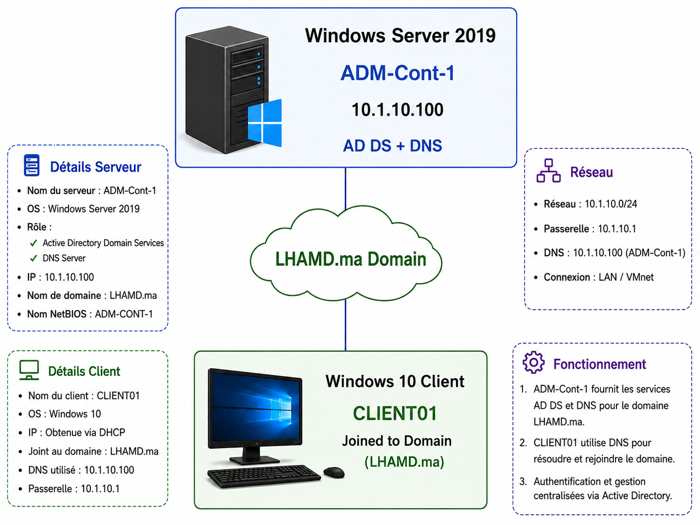

<div align="center">

# Windows Server 2019 Active Directory Lab

Active Directory Domain Services (AD DS) deployment using Windows Server 2019 and Windows 10.



<br>


</div>

---

## 📋 Table of Contents

- [Project Overview](#-project-overview)
- [Lab Architecture](#-lab-architecture)
- [Features](#-features)
- [Repository Structure](#-repository-structure)
- [Deployment Workflow](#-deployment-workflow)
- [Verification](#-verification)
- [Screenshots](#-screenshots)
- [Documentation](#-documentation)
- [Technologies Used](#-technologies-used)

---

## 🎯 Project Overview

This project demonstrates the deployment and configuration of a complete Microsoft Active Directory environment using Windows Server 2019.

The infrastructure provides:

- Active Directory Domain Services (AD DS)
- DNS Services
- Centralized Authentication
- User and Group Management
- Organizational Units (OU)
- Windows 10 Domain Integration

---

## 🏗️ Lab Architecture

| Component | Configuration |
|------------|---------------|
| Domain | LHAMD.ma |
| Domain Controller | ADM-Cont-1 |
| OS | Windows Server 2019 |
| Server IP | 10.1.10.100 |
| DNS Server | 10.1.10.100 |
| Client | CLIENT01 |
| Client OS | Windows 10 |
| Network | 10.1.10.0/24 |

---

## 🚀 Features

<details>
<summary><b>Active Directory Services</b></summary>

- Domain Controller Deployment
- Active Directory Domain Services Installation
- Organizational Units Creation
- User Management
- Security Groups

</details>

<details>
<summary><b>DNS Configuration</b></summary>

- DNS Service Installation
- Domain Name Resolution
- Client DNS Integration

</details>

<details>
<summary><b>Client Integration</b></summary>

- Windows 10 Domain Join
- Domain User Authentication
- DNS Verification

</details>

---

## 📂 Repository Structure

```text
windows-server-active-directory
│
├── configs/
│   ├── domain-information.txt
│   ├── ip-configuration.txt
│   ├── users-and-groups.txt
│   └── verification-commands.txt
│
├── docs/
│   ├── Installation-Guide.md
│   └── Lab-Report.md
│
├── screenshots/
│   ├── 01-windows-server-installation.png
│   ├── ...
│   └── 17-server-manager.png
│
├── topology/
│   ├── network-topology.md
│   └── network-topology.png
│
└── README.md
```

---

## 🔄 Deployment Workflow

```text
Windows Server Installation
          │
          ▼
Static IP Configuration
          │
          ▼
Server Rename
          │
          ▼
AD DS Installation
          │
          ▼
Domain Controller Promotion
          │
          ▼
LHAMD.ma Domain Creation
          │
          ▼
OU & Security Groups
          │
          ▼
User Creation
          │
          ▼
Windows 10 Domain Join
          │
          ▼
Verification & Testing
```

---

## ✅ Verification

```powershell
hostname

ipconfig /all

whoami

echo %logonserver%

nslookup LHAMD.ma

ping ADM-Cont-1

systeminfo
```

Additional commands:

```text
configs/verification-commands.txt
```

---

## 📸 Screenshots

This repository includes 17 screenshots covering:

- Windows Server Installation
- Static IP Configuration
- AD DS Installation
- Domain Controller Promotion
- Organizational Units
- Security Groups
- User Creation
- Domain Join
- Verification Commands

---

## 📚 Documentation

| File | Description |
|--------|-------------|
| docs/Installation-Guide.md | Step-by-step installation |
| docs/Lab-Report.md | Full lab report |
| topology/network-topology.md | Network design |
| configs/* | Configuration references |

---

## 🛠️ Technologies Used

- Windows Server 2019
- Active Directory Domain Services
- DNS Server
- Windows 10
- VMware Workstation
- PowerShell

---

## 👨‍💻 Author

**Jawad Manhajay**

System & Network Administration Student

GitHub: https://github.com/jaouad-manhajay

---

<div align="center">

⭐ Star this repository if you found it useful.

</div>
